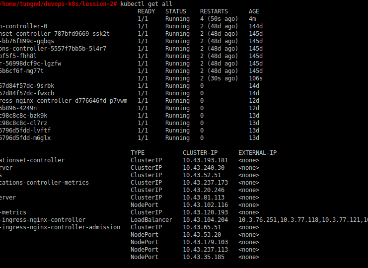
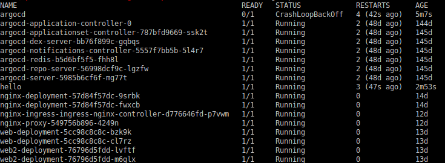
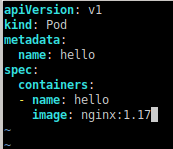

# Lesson 2 - Create your first pod

1. Tạo file pod.yaml

```bash
/home/tungnd/devops-k8s/lession-2# cat pod.yaml
apiVersion: v1
kind: Pod
metadata:
  name: argocd
spec:
  containers:
  - name: hello
    image: alpine
    command: ["sh", "-c", "echo Hello World && sleep 30"]

```

- apiVersion phải là v1
2. Apply

```bash
/home/tungnd/devops-k8s/lession-2# kubectl apply -f pod.yaml
pod/hello created

```

3. Check

```bash
Check log
/home/tungnd/devops-k8s/lession-2# kubectl logs hello
Hello World

```

4. Get all 





5. Edit lại file pod



6. Apply lại

```bash
/home/tungnd/devops-k8s/lession-2# kubectl delete pod hello
pod "hello" deleted
/home/tungnd/devops-k8s/lession-2# kubectl apply -f pod.yaml
pod/hello created
/home/tungnd/devops-k8s/lession-2# kubectl exec -it hello -- /bin/bash
root@hello:/#
root@hello:/#
root@hello:/# service nginx status
[ ok ] nginx is running.

```

7. Xóa pods

```bash
/home/tungnd/devops-k8s/lession-2# kubectl delete pod hello
pod "hello" deleted

```

# Lesson 3 - **Create a Toolbox pod**

1. Create

```bash
/home/tungnd/devops-k8s/lession-3# cat toolbox.json
{
  "apiVersion": "v1",
  "kind": "Pod",
  "metadata": {
    "name": "toolbox"
  },
  "spec": {
    "containers": [
      {
        "name": "toolbox",
        "image": "registry.access.redhat.com/ubi8/ubi",
        "command": ["/bin/bash", "-c", "--"],
        "args": ["while true; do sleep 30; done;"]
      }
    ]
  }
}

```

2. Apply

```bash
/home/tungnd/devops-k8s/lession-3# kubectl apply -f toolbox.json
pod/toolbox created

```

3. Check 

```bash
/home/tungnd/devops-k8s/lession-3# kubectl exec -it toolbox bash
kubectl exec [POD] [COMMAND] is DEPRECATED and will be removed in a future version. Use kubectl exec [POD] -- [COMMAND] instead.
[root@toolbox /]#
[root@toolbox /]#
[root@toolbox /]#
[root@toolbox /]# ls
bin  boot  dev	etc  home  lib	lib64  lost+found  media  mnt  opt  proc  root	run  sbin  srv	sys  tmp  usr  var
[root@toolbox /]# exit
exit

```