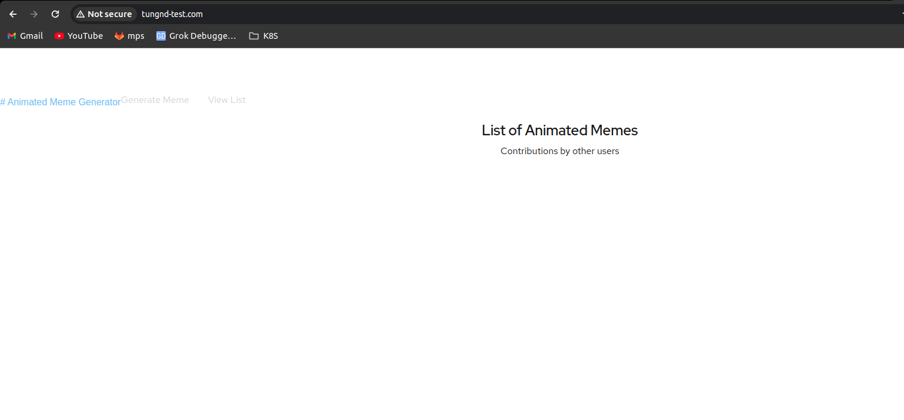

# Lesson 6 - Expose Your Application To The Outside World

- Bài lab được tiếp tục thực hiện trên cụm RKE. Namespace sử dụng là techmaster
- Ở phần lesson 4 5 đã tạo deployment và service

```yaml
/home/tungnd/techmaster/lesson# kubectl get all --namespace techmaster
NAME                                  READY   STATUS    RESTARTS   AGE
pod/k8scourse-front-6b8458f74-2vtg8   1/1     Running   0          2m47s
pod/k8scourse-front-6b8458f74-fjghb   1/1     Running   0          2m47s
pod/toolbox                           1/1     Running   0          12m

NAME                      TYPE        CLUSTER-IP     EXTERNAL-IP   PORT(S)   AGE
service/k8scourse-front   ClusterIP   10.43.87.226   <none>        80/TCP    37s

NAME                              READY   UP-TO-DATE   AVAILABLE   AGE
deployment.apps/k8scourse-front   2/2     2            2           2m47s

NAME                                        DESIRED   CURRENT   READY   AGE
replicaset.apps/k8scourse-front-6b8458f74   2         2         2       2m47s

```

- Phần lesson 6 sẽ thiết lập ingress để expose app ra ngoài. Với cụm RKE sẽ có 1 số thiết lập thêm
- File ingress.yaml

```yaml
apiVersion: networking.k8s.io/v1
kind: Ingress
metadata:
  annotations:
  name: main
spec:
  ingressClassName: nginx
  rules:
  - host: tungnd-test.com
    http:
      paths:
      - backend:
          service:
            name: k8scourse-front
            port:
              number: 80
        path: /
        pathType: Prefix
```

- Thiết lập

```yaml
/home/tungnd/techmaster# kubectl apply -f ingress.yaml --namespace techmaster
ingress.networking.k8s.io/main created
/home/tungnd/techmaster# kubectl get ingress --namespace techmaster
NAME   CLASS   HOSTS             ADDRESS   PORTS   AGE
main   nginx   tungnd-test.com             80      18s

```

- Có thể truy cập qua trình duyệt khi trỏ host



# **Lesson 7 - Kubernetize Your Backend**

File backend.yaml

```yaml
apiVersion: apps/v1
kind: Deployment
metadata:
  namespace: techmaster
  name: k8scourse-back
  labels:
    app: k8scourse-demo
    role: backend
spec:
  template:
    metadata:
      labels:
        app: k8scourse-demo
        role: backend
    spec:
      containers:
      - name: api
        image: joellord/k8scourse-back
  selector:
    matchLabels:
      role: backend
  replicas: 1
---
apiVersion: v1
kind: Service
metadata:
  namespace: techmaster
  name: k8scourse-back
  labels:
    role: backend
spec:
  selector:
    role: backend
  ports:
    - protocol: TCP
      port: 80
      targetPort: 3000
    
```

```yaml
/home/tungnd/techmaster/lesson# kubectl apply -f backend.yaml
deployment.apps/k8scourse-back created
service/k8scourse-back created

/home/tungnd/techmaster/lesson# kubectl get all --namespace techmaster
NAME                                  READY   STATUS              RESTARTS   AGE
pod/k8scourse-back-7445c9d8cc-f49zf   0/1     ContainerCreating   0          12s
pod/k8scourse-front-6b8458f74-2vtg8   1/1     Running             0          19m
pod/k8scourse-front-6b8458f74-fjghb   1/1     Running             0          19m
pod/toolbox                           1/1     Running             0          28m

NAME                      TYPE        CLUSTER-IP      EXTERNAL-IP   PORT(S)   AGE
service/k8scourse-back    ClusterIP   10.43.217.127   <none>        80/TCP    12s
service/k8scourse-front   ClusterIP   10.43.87.226    <none>        80/TCP    17m

NAME                              READY   UP-TO-DATE   AVAILABLE   AGE
deployment.apps/k8scourse-back    0/1     1            0           12s
deployment.apps/k8scourse-front   2/2     2            2           19m

NAME                                        DESIRED   CURRENT   READY   AGE
replicaset.apps/k8scourse-back-7445c9d8cc   1         1         0       12s
replicaset.apps/k8scourse-front-6b8458f74   2         2         2       19m

```

Exec vào toolbox để kiểm tra

```yaml
[root@toolbox /]# curl k8scourse-back/health
{"errno":-111,"code":"ECONNREFUSED","syscall":"connect","address":"127.0.0.1","port":3306,"fatal":true}[root@toolbox /]#
```

Báo hiện không có kết nối đến port 3306 (Mysql) nghi là hiện tại chưa có db nên app chưa lên được