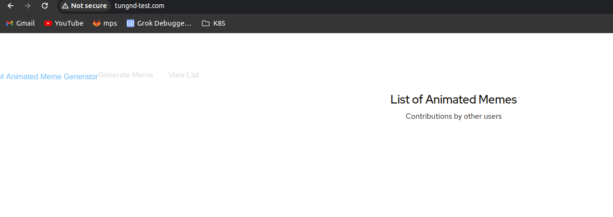
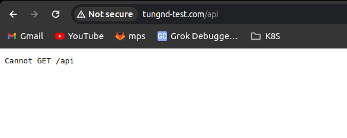
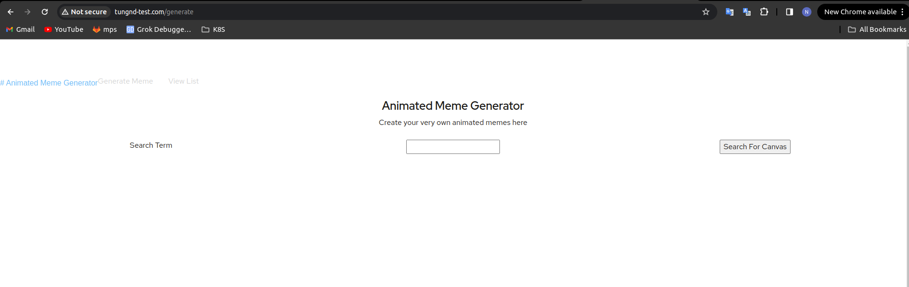
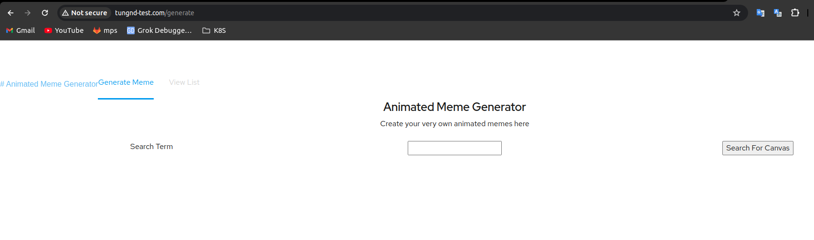

# Lesson 8 - Use paths to expose multiple services

File ingress.yaml

```yaml
apiVersion: networking.k8s.io/v1
kind: Ingress
metadata:
  annotations:
    nginx.ingress.kubernetes.io/rewrite-target: /$2
  name: main
spec:
  ingressClassName: nginx
  rules:
  - host: tungnd-test.com
    http:
      paths:
      - backend:
          service:
            name: k8scourse-back
            port:
              number: 80
        path: /api
        pathType: Prefix
      - backend:
          service:
            name: k8scourse-front
            port:
              number: 80
        path: /

home/tungnd/techmaster/lesson# kubectl apply -f ingress.yaml --namespace techmaster
ingress.networking.k8s.io/main created

```

- Trỏ hosts truy cập trên trình duyệt





# **Lesson 9 - Change Environment Variables For A Deployment**

- File deployment.yaml

```yaml
apiVersion: apps/v1
kind: Deployment
metadata:
  name: k8scourse-front
  namespace: techmaster
  labels:
    app: k8scourse-demo
    role: frontend
spec:
  template:
    metadata:
      labels:
        app: k8scourse-demo
        role: frontend
    spec:
      containers:
      - name: server
        image: joellord/k8scourse-front
        env:
        - name: BASE_URL
          value: api
  selector:
    matchLabels:
      role: frontend
  replicas: 2

```

```yaml
/home/tungnd/techmaster/lesson# kubectl get pods -l role=frontend --namespace techmaster
NAME                               READY   STATUS    RESTARTS   AGE
k8scourse-front-6447564879-9nv8z   1/1     Running   0          21s
k8scourse-front-6447564879-w4b9j   1/1     Running   0          21s

```



# **Lesson 10 - Persist Data And Volumes**

Cụm RKE đã được set up StorageClass NFS

```yaml
/home/tungnd/gitlab-1# kubectl get storageclass
NAME                   PROVISIONER                                     RECLAIMPOLICY   VOLUMEBINDINGMODE   ALLOWVOLUMEEXPANSION   AGE
nfs-client (default)   cluster.local/nfs-subdir-external-provisioner   Delete          Immediate           true                   6d21h

```

- File mysql-pv.yaml

```yaml
apiVersion: v1
kind: PersistentVolume
metadata:
  name: mysql-pv
spec:
  storageClassName: nfs-client
  capacity:
    storage: 1Gi
  accessModes:
    - ReadWriteOnce
  nfs:
    path: "/data/delete/"
    server: 10.3.77.197
---
apiVersion: v1
kind: PersistentVolumeClaim
metadata:
  name: mysql-pvc
spec:
  accessModes:
    - ReadWriteOnce
  resources:
    requests:
      storage: 1Gi
```

- Với server 10.3.77.197 là server lưu trữ với phân vùng /data/delete/

```yaml
home/tungnd/techmaster/lesson# kubectl apply -f mysql-pv.yaml --namespace techmaster
persistentvolume/mysql-pv created
persistentvolumeclaim/mysql-pvc created
/home/tungnd/techmaster/lesson# kubectl get pv,pvc --namespace techmaster

NAME                                                        CAPACITY   ACCESS MODES   RECLAIM POLICY   STATUS        CLAIM                                     STORAGECLASS   REASON   AGE
persistentvolume/mysql-pv                                   1Gi        RWO            Retain           Available                                                                       65s
NAME                              STATUS   VOLUME                                     CAPACITY   ACCESS MODES   STORAGECLASS   AGE
persistentvolumeclaim/mysql-pvc   Bound    pvc-00c7bfae-2092-4963-8059-f1c8c1043870   1Gi        RWO            nfs-client     65s

```

# **Lesson 11 - Deploy Your Database**

File mysql.yaml

```yaml
apiVersion: v1
kind: Service
metadata:
  name: mysql
spec:
  ports:
  - port: 3306
  selector:
    role: db
---
apiVersion: apps/v1
kind: Deployment
metadata:
  name: mysql
spec:
  selector:
    matchLabels:
      role: db
  template:
    metadata:
      labels:
        app: k8scourse
        role: db
    spec:
      containers:
      - image: mysql:5.7
        name: mysql
        env:
        - name: MYSQL_USER
          value: user
        - name: MYSQL_PASSWORD
          value: mysql
        - name: MYSQL_ROOT_PASSWORD
          value: root
        ports:
        - containerPort: 3306
        volumeMounts:
        - name: mysql-storage
          mountPath: /var/lib/mysql
      volumes:
      - name: mysql-storage
        persistentVolumeClaim:
          claimName: mysql-pvc

```

```yaml
/home/tungnd/techmaster/lesson# kubectl apply -f mysql.yaml --namespace techmaster
service/mysql created
deployment.apps/mysql created

```

```yaml
home/tungnd/techmaster/lesson# kubectl get pods -l role=db --namespace techmaster
NAME                   READY   STATUS    RESTARTS   AGE
mysql-55d7f547-kn8dj   1/1     Running   0          4m3s

home/tungnd/techmaster/lesson# kubectl exec -it  mysql-55d7f547-kn8dj --namespace techmaster -- /bin/bash
bash-4.2#
bash-4.2#
bash-4.2#
bash-4.2# mysql -uuser -pmysql
mysql: [Warning] Using a password on the command line interface can be insecure.
Welcome to the MySQL monitor.  Commands end with ; or \g.
Your MySQL connection id is 2
Server version: 5.7.44 MySQL Community Server (GPL)

Copyright (c) 2000, 2023, Oracle and/or its affiliates.

Oracle is a registered trademark of Oracle Corporation and/or its
affiliates. Other names may be trademarks of their respective
owners.

Type 'help;' or '\h' for help. Type '\c' to clear the current input statement.

mysql> SHOW DATABASES;
+--------------------+
| Database           |
+--------------------+
| information_schema |
+--------------------+
1 row in set (0.00 sec)

```

# **Lesson 12 - Seed the Database And Connect The Backend**

```yaml
/home/tungnd/techmaster/lesson# kubectl run --image=mysql:5.7 --restart=Never --env="MYSQL_RANDOM_ROOT_PASSWORD=true" mysql-client
pod/mysql-client created

```

Git clone code về server để thực hiện copy file .sql lên pods

```yaml
home/tungnd/techmaster/lesson# git clone https://github.com/ladung/k8s-course.git
Cloning into 'k8s-course'...
remote: Enumerating objects: 81, done.
remote: Counting objects: 100% (81/81), done.
remote: Compressing objects: 100% (71/71), done.
remote: Total 81 (delta 4), reused 78 (delta 4), pack-reused 0
Unpacking objects: 100% (81/81), 6.43 MiB | 3.65 MiB/s, done.

home/tungnd/techmaster/lesson/k8s-course/db# kubectl cp init.sql mysql-client:/tmp/init.sql --namespace techmaster

home/tungnd/techmaster/lesson/k8s-course/db# kubectl exec -it mysql-client --namespace techmaster -- /bin/bash
bash-4.2# ls /tmp
init.sql

```

```yaml
/home/tungnd/techmaster/lesson/k8s-course/db# kubectl exec -it mysql-client --namespace techmaster -- /bin/bash
bash-4.2# ls /tmp
init.sql
bash-4.2# mysql -hmysql -uroot -proot < /tmp/init.sql
mysql: [Warning] Using a password on the command line interface can be insecure.
bash-4.2#
bash-4.2#
bash-4.2# exit
exit
root@mps-staging-worker-10-3-76-251:/home/tungnd/techmaster/lesson/k8s-course/db# kubectl delete pod mysql-client --namespace techmaster
pod "mysql-client" deleted

```

- Chạy kubectl run test database đã set up

```yaml
home/tungnd/techmaster/lesson/k8s-course/db# kubectl run -it --rm --image=mysql:5.7 --restart=Never mysql-client --namespace techmaster -- mysql -hmysql -uuser -pmysql
If you don't see a command prompt, try pressing enter.

mysql>
mysql> use images;
Reading table information for completion of table and column names
You can turn off this feature to get a quicker startup with -A

Database changed
mysql> select * from images;
+----+---------+-------------------+
| id | caption | filename          |
+----+---------+-------------------+
|  1 | Hello   | hello-caption.gif |
+----+---------+-------------------+
1 row in set (0.00 sec)

mysql> exit
Bye
pod "mysql-client" deleted

```

- Config lại file backend.yaml

```yaml
/home/tungnd/techmaster/lesson# cat backend.yaml
apiVersion: apps/v1
kind: Deployment
metadata:
  namespace: techmaster
  name: k8scourse-back
  labels:
    app: k8scourse-demo
    role: backend
spec:
  template:
    metadata:
      labels:
        app: k8scourse-demo
        role: backend
    spec:
      containers:
      - name: api
        image: joellord/k8scourse-back
        env:
        - name: MYSQL_HOST
          value: mysql
        - name: MYSQL_USER
          value: user
        - name: MYSQL_PASS
          value: mysql
  selector:
    matchLabels:
      role: backend
  replicas: 1
---
apiVersion: v1
kind: Service
metadata:
  namespace: techmaster
  name: k8scourse-back
  labels:
    role: backend
spec:
  selector:
    role: backend
  ports:
    - protocol: TCP
      port: 80
      targetPort: 3000

/home/tungnd/techmaster/lesson# kubectl apply -f backend.yaml
deployment.apps/k8scourse-back configured
service/k8scourse-back unchanged

```

- Vào toolbox curl sẽ không còn bị lỗi nữa

```yaml
[root@toolbox /]# curl k8scourse-back/health
{"status":"running","timestamp":1716367607981,"db":true}[root@toolbox /]#
```

# **Lesson 13 - Unmonolithize Your Backend**

```yaml
/home/tungnd/techmaster/lesson/k8s-course# cp -r back microback
/home/tungnd/techmaster/lesson/k8s-course# cp ./services/back/* ./microback
/home/tungnd/techmaster/lesson/k8s-course# cd microback/

```

File microservice.yaml

```yaml
apiVersion: v1
kind: PersistentVolume
metadata:
  name: micro-pv
spec:
  storageClassName: nfs-client
  capacity:
    storage: 1Gi
  accessModes:
    - ReadWriteOnce
  nfs:
    path: "/data/delete/"
    server: 10.3.77.197
---
apiVersion: v1
kind: PersistentVolumeClaim
metadata:
  name: micro-pvc
spec:
  accessModes:
    - ReadWriteOnce
  resources:
    requests:
      storage: 1Gi
---
apiVersion: apps/v1
kind: Deployment
metadata:
  name: microback
spec:
  template:
    metadata:
      labels:
        app: k8scourse-demo
        role: backend
        microservice: microback
    spec:
      containers:
      - name: microback
        image: joellord/k8scourse-microback
        env:
        - name: MYSQL_HOST
          value: mysql
        - name: MYSQL_USER
          value: user
        - name: MYSQL_PASS
          value: mysql
        - name: GIF_CAPTION_SVC
          value: microgifcap
        - name: IMAGE_PATH
          value: /tmp/gifcaptionizer
        volumeMounts:
        - name: micro-storage
          mountPath: /tmp/gifcaptionizer
      volumes:
      - name: micro-storage
        persistentVolumeClaim:
          claimName: micro-pvc
  selector:
    matchLabels:
      microservice: microback
---
apiVersion: apps/v1
kind: Deployment
metadata:
  name: microgifcap
spec:
  template:
    metadata:
      labels:
        app: k8scourse-demo
        role: backend
        microservice: microgifcap
    spec:
      containers:
      - name: microgifcap
        image: joellord/k8scourse-microgifcap
        env:
        - name: IMAGE_PATH
          value: /tmp/gifcaptionizer
        volumeMounts:
        - name: micro-storage
          mountPath: /tmp/gifcaptionizer
      volumes:
      - name: micro-storage
        persistentVolumeClaim:
          claimName: micro-pvc
  selector:
    matchLabels:
      microservice: microgifcap
  replicas: 4
---
apiVersion: v1
kind: Service
metadata:
  name: microback
  labels:
    role: backend
    microservice: microback
spec:
  selector:
    microservice: microback
  ports:
    - protocol: TCP
      port: 80
      targetPort: 3000
---
apiVersion: v1
kind: Service
metadata:
  name: microgifcap
  labels:
    role: backend
    microservice: microgifcap
spec:
  selector:
    microservice: microgifcap
  ports:
    - protocol: TCP
      port: 80
      targetPort: 4000
---
apiVersion: networking.k8s.io/v1
kind: Ingress
metadata:
  name: main
  annotations:
    nginx.ingress.kubernetes.io/rewrite-target: /$2
spec:
  ingressClassName: nginx
  rules:
  - host: tungnd-test.com
    http:
      paths:
        - backend:
            service:
              name: microback
              port:
                number: 80
          path: /api
          pathType: Prefix
        - backend:
            service:
              name: k8scourse-front
              port:
                number: 80
          path: /
          pathType: Prefix

```

Trỏ host truy cập trên trình duyệt 



# **Lesson 14 - Clean Up Regularly With A Cron Job**

File crontab.yaml

```yaml
apiVersion: batch/v1
kind: CronJob
metadata:
  name: cleanup
spec:
  schedule: "*/1 * * * *"
  jobTemplate:
    spec:
      template:
        spec:
          volumes:
          - name: micro-storage
            persistentVolumeClaim:
              claimName: micro-pvc
          containers:
          - name: cleanup
            image: registry.access.redhat.com/ubi8/ubi
            args:
            - /bin/bash
            - -c
            - for d in /tmp/gifcaptionizer/*/ ; do rm -rf "$d"; done
            volumeMounts:
            - name: micro-storage
              mountPath: /tmp/gifcaptionizer
          restartPolicy: Never

```

Apply

```yaml
/home/tungnd/techmaster/lesson# kubectl apply -f cronjob.yaml --namespace techmaster
cronjob.batch/cleanup created

```

Get cronjob

```yaml
home/tungnd/techmaster/lesson# kubectl get cronjobs --namespace techmaster
NAME      SCHEDULE      SUSPEND   ACTIVE   LAST SCHEDULE   AGE
cleanup   */1 * * * *   False     0        31s             2m44s

```

```yaml
/home/tungnd/techmaster/lesson# kubectl exec -it microback-6b75c46db4-th4jf --namespace techmaster -- /bin/bash
node@microback-6b75c46db4-th4jf:/app$
node@microback-6b75c46db4-th4jf:/app$
node@microback-6b75c46db4-th4jf:/app$ cd /tmp/gifcaptionizer/
node@microback-6b75c46db4-th4jf:/tmp/gifcaptionizer$ ls
queries.active

```